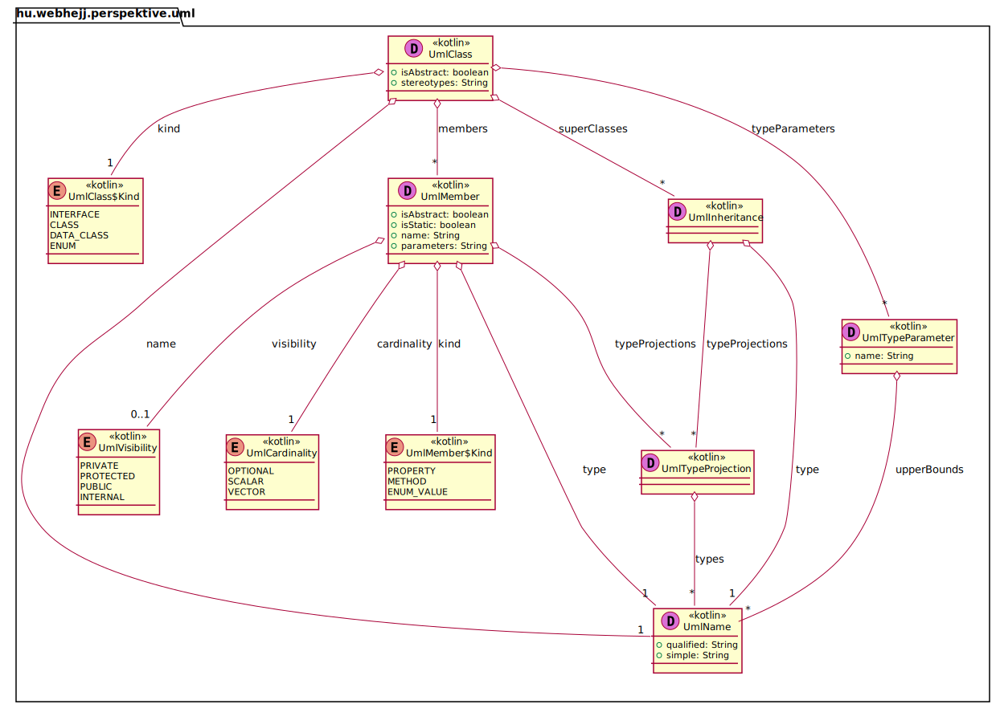
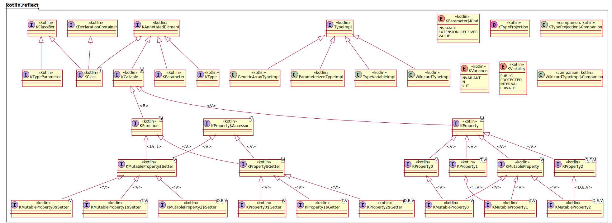

# Perspektive -- a Kotlin diagramming tool

## Overview

Perspektive is a diagramming tool written in Kotlin. It can scan code using Kotlin reflection and generate configurable
diagrams of the code structure. This
configuration allows hiding of certain elements, such as framework types, to keep the diagrams focused.

## UML class diagrams

Currently, Perspektive supports generating UML class diagrams of Java and Kotlin code
using [PlantUML](https://plantuml.com/).

The simplest way to get started is to add Perspektive as a `test` dependency and write test methods for each diagram
you'd like to render. This keeps the
Perspektive dependencies off your application classpath and the diagrams will be refreshed each time you run tests.

For examples see the test classes in this project:

- [ClassDiagramTest](src/test/kotlin/hu/webhejj/perspektive/ClassDiagramTest.kt)

## Examples

This diagram shows the data classes that model UML class diagrams for rendering in Perspektive.

```kotlin
@Test
fun umlModel() {
    val classDiagram = ClassDiagram()
    classDiagram.scanTypes(hu.webhejj.perspektive.uml.UmlClass::class)
    classDiagram.write(File("umlmodel.plantuml"))
}
```



This is a diagram of kotlin reflection classes.


This is a diagram focuses just on the inheritance relationships between classes, hiding members.


